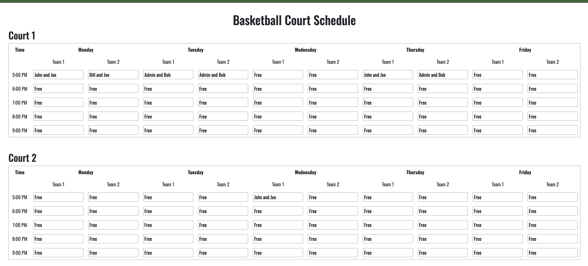
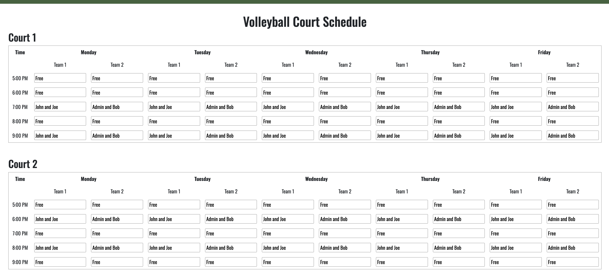

## GamePlan Overview
GamePlan is a web application that allows UH students to find and join a team or reserve a court time for their group to play basketball or volleyball at UH Mānoa recreation center. Since there are only two courts, the main purpose of GamePlan is to help students have a more organized system when it comes to securing court time, while also giving the opportunity to meet new people. The app consists of pages such as sign in, reservation, schedules for the current day with scores, and schedules for the current week. 

  

The project was completed by dividing the tasks of the project between the five people in the team. This was done with issue driven project management through GitHub. We also maintained strong communication using a shared Google Doc and held regular team meetings to check in on progress and resolve problems.

## My Contributions and Experience
My role in this project was mostly front-end development. I was able to take my teammates' mock drawings and create the HTML version of the Basketball and Volleyball Schedule page using React and Next.js. I was able to make the final version of the web app look more appealing by drawing a logo, using overlay components, adjusting fonts, and improving the structure of the navbar and footer. This was also my first time using Playwright, which I used to test early versions of my pages. Through this experience, I improved my skills in component-based UI development and learned how to translate design concepts into functional code through personal research and applying what I have learned in this class. I also gained valuable experience working on a team since this was my first group project in Computer Science. 
See our deployed version, repository, and organization page.  

  
  

See our [deployed](https://gameplanz.vercel.app/) version, [repository](https://github.com/TheC-es/GamePlan), and [organization](https://thec-es.github.io/) page.  
