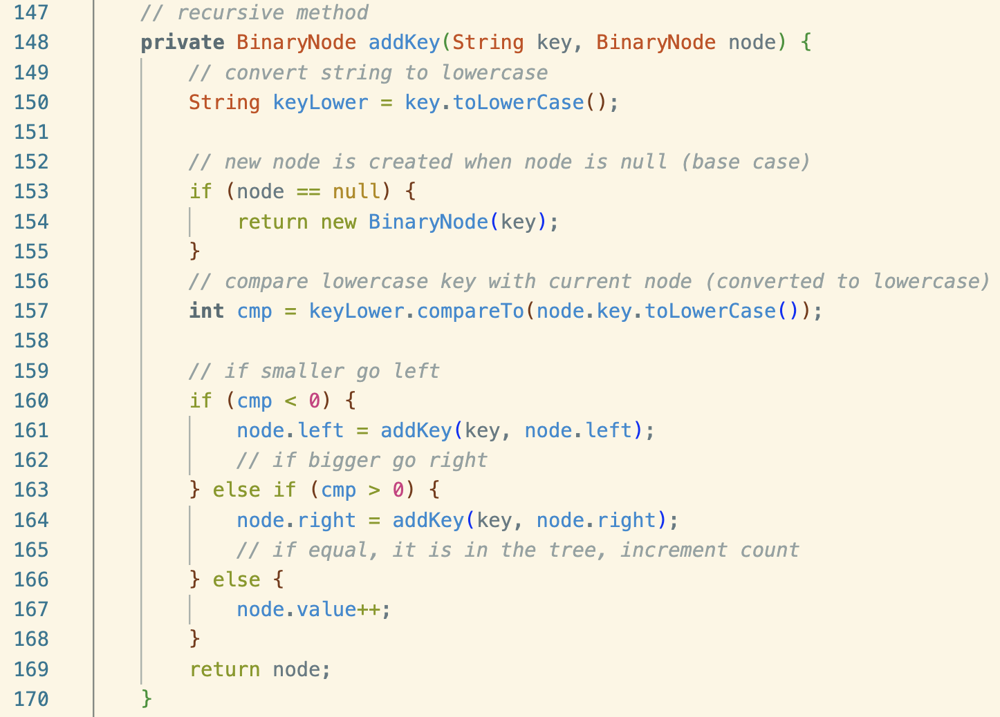
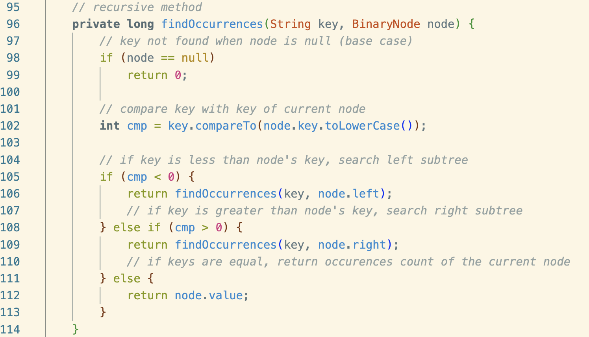
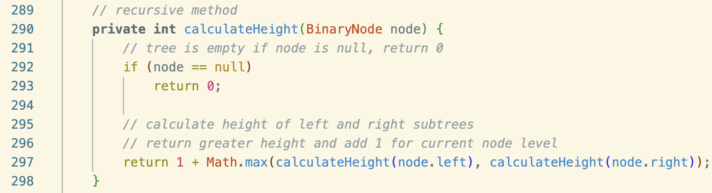

I developed this string analysis program that uses a <b>binary search tree</b> as an assignment in ICS 211, Spring 2024. From this program, I learned how to use a binary search tree to read strings from a file and track the occurrence of each unique word, which ultimately is useful to efficently organize data.

This program had to be done in a week in [Eclipse](https://eclipseide.org/) using Java. The most challenging part of this program was figuring out how to traverse about in the binary search tree. Despite the challenges I faced while writing this program, I gained an understanding of how to traverse a binary search tree using recursive methods, such as in-order traversal to retrieve all unique words in sorted order and other methods for searching, counting, and calculating tree properties. 

Below are examples of key recursive methods that demonstrate the functionality of the program:

<b>Adding Nodes:</b> A method that shows how the program recursively builds the binary search tree by traversing the tree to find the correct position for a new node or increment the value if the key already exists:

<b>Retrieving Key:</b> A method how recursion is used to traverse the tree to retrieve a specific key:

<b>Calculating Height: A method that shows how recursion can be used to compare paths in a tree by calculating its the height:

