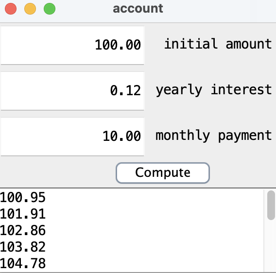

<div class="text-center p-4">
  
</div>

I developed a Java Swing account balance calculator in ICS 211, Spring 2024. This program calculates and displays the monthly account balance over a 12-month period after users input the initial account amount, yearly interest rate, and monthly payment. 

Here is some code that illustrates how we read values from the line sensors:

```cpp
byte ADCRead(byte ch)
{
    word value;
    ADC1SC1 = ch;
    while (ADC1SC1_COCO != 1)
    {   // wait until ADC conversion is completed   
    }
    return ADC1RL;  // lower 8-bit value out of 10-bit data from the ADC
}
```

```cpp
// initialize string to add in the account balances
		String calculatedOutput = "";

		// iterate through the months of the whole year
		for (int month = 1; month <= 12; month++) {
			// calculate the amount after each month (shows when debt is payed off or how
			// much interest will be earned)
			amount = amount * (1 + (interest / 100)) + payment;

			// adding formatted results of the account balance
			calculatedOutput += String.format("%.2f", amount) + "\n";
		}
		// returns output
		return calculatedOutput;
```
